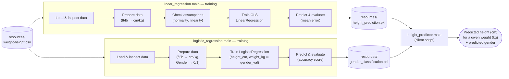

# Supervised ML — Height & Gender Prediction

A learning project that walks through supervised ML workflows with
[scikit-learn](https://scikit-learn.org/): load data, check assumptions, train a model,
predict, evaluate, deploy the trained model to disk (`.pkl`), and load it back from an
independent client. Two models share the same `weight-height.csv` dataset:

- **Linear Regression** — predicts a person's **height** from their **weight**.
- **Logistic Regression** — classifies a person's **gender** from their **height & weight**.

## Overview



### Ordinary Least Squares — Linear Regression

The model fits a straight line `y = mx + c` (`height_cm = m · weight_kg + c`) through the
training data. Ordinary Least Squares (OLS) chooses the `m` (slope) and `c` (intercept) that
minimize the **sum of squared residuals** — the squared vertical distance between each actual
point and the line's prediction:

```
minimize  Σ (yᵢ - ŷᵢ)²   where  ŷᵢ = m·xᵢ + c
```

Squaring the residuals penalizes larger errors more heavily and keeps positive/negative
errors from cancelling out, giving a single line with a closed-form solution — no iterative
training loop needed. This is what `sklearn.linear_model.LinearRegression.fit()` computes in
step 6 of the workflow below, and it's the same fit whose residuals (`error = y - y_pred`)
are inspected in the evaluation step.

### Logistic Regression — Gender Classification

Unlike linear regression's continuous output, logistic regression predicts a **binary class**
(`Male` → `0`, `Female` → `1`) by fitting a sigmoid curve over a linear combination of the
features (`height_cm`, `weight_kg`), and thresholding the resulting probability at 0.5. This is
what `sklearn.linear_model.LogisticRegression.fit()` computes in step 6 of the workflow below;
`accuracy_score` in the evaluation step reports the fraction of correctly classified samples.

## Project structure

```
resources/
  weight-height.csv          # sample dataset (Gender, Height in inches, Weight in pounds)
  height_prediction.pkl      # trained model, deployed by linear_regression.main
  gender_classification.pkl  # trained model, deployed by logistic_regression.main
src/
  linear_regression/
    __init__.py             # main() — trains, evaluates, and deploys the height model to .pkl
  logistic_regression/
    __init__.py             # main() — trains, evaluates, and deploys the gender model to .pkl
  height_predictor/
    __init__.py             # main() — loads both .pkl models, predicts height and gender
  utils/
    __init__.py             # pretty_log / log_title console helpers
```

## Workflow (`linear_regression.main`)

1. **Load the data** — reads `resources/weight-height.csv` into a pandas DataFrame.
2. **Data understanding** — inspects shape, null counts, and dtypes.
3. **Data preparation**
   - Drops `Gender` (not numerical, not suited for linear regression).
   - Converts `Height` (ft) → `height_cm` and `Weight` (lb) → `weight_kg`.
4. **Assumption tests**
   - A1. Normality — histogram of weight, follows a bell curve. ✅
   - A2. Linearity — scatter plot of weight vs. height. ✅
   - A3. Multicollinearity — skipped (single feature, no other columns to correlate).
   - A4. Autoregression — skipped (single feature vs. single target).
   - Homoscedasticity and zero residual mean are checked during model evaluation instead.
5. **Model building** — `X = weight_kg`, `y = height_cm`.
6. **Model training** — `sklearn.linear_model.LinearRegression` fit via Ordinary Least Squares,
   producing the deliverables of `y = mx + c`: the slope/coefficient (`m`) and intercept (`c`).
7. **Prediction** — automatic prediction of `y_pred` for the full input set (a manual,
   point-by-point prediction path is sketched out but currently commented out).
8. **Model evaluation** — compares actual vs. predicted height and reports the mean error rate.
9. **Model deployment** — pickles the trained `LinearRegression` model to
   `resources/height_prediction.pkl`.

All steps print through `utils.pretty_log` / `utils.log_title` for readable, boxed console output.

## Workflow (`logistic_regression.main`)

1. **Load the data** — reads `resources/weight-height.csv` into a pandas DataFrame.
2. **Data understanding** — inspects shape, null counts, and dtypes.
3. **Data preparation**
   - Encodes `Gender` → `gender_val` (`Male` → `0`, `Female` → `1`).
   - Converts `Height` (ft) → `height_cm` and `Weight` (lb) → `weight_kg`.
4. **Model building** — `X = [height_cm, weight_kg]`, `y = gender_val`.
5. **Model training** — `sklearn.linear_model.LogisticRegression` fit, producing the
   coefficients (`m`) and intercept for the decision boundary.
6. **Prediction** — predicts `y_pred` (gender) for the full input set.
7. **Model evaluation** — reports `accuracy_score` and lists any misclassified records.
8. **Model deployment** — pickles the trained `LogisticRegression` model to
   `resources/gender_classification.pkl`.

## Serving predictions (`height_predictor.main`)

A separate, lightweight client loads both deployed `.pkl` models and predicts on new
inputs without needing to retrain — the split between the training scripts (train + deploy)
and `height_predictor` (load + predict) mirrors a real train/serve boundary. It predicts
height from a sample weight, then gender from a sample height/weight pair.

## Requirements

- Python >= 3.14
- [uv](https://docs.astral.sh/uv/) for dependency management
- Dependencies (see `pyproject.toml`): `pandas`, `matplotlib`, `scikit-learn`

## Running it

```bash
uv sync
uv run linear-regression     # or: uv run hwp — trains, evaluates, and deploys the height model
uv run logistic-regression   # or: uv run log-reg — trains, evaluates, and deploys the gender model
uv run hp                    # loads both deployed .pkl models and predicts height + gender
```

`linear-regression` / `hwp`, `logistic-regression` / `log-reg`, and `hp` are registered console
scripts that call `linear_regression.main`, `logistic_regression.main`, and
`height_predictor.main` respectively.

## Status

Complete — data prep, assumption checks, model training, prediction, evaluation, and
deployment to `.pkl` are all implemented for both linear and logistic regression, along with
an independent client that loads both deployed models and serves predictions.

---

### Troubleshooting:

> [!WARNING]
>
> X doesn't have valid feature names:
>
> `sklearn/utils/validation.py:2827: UserWarning: X does not have valid feature names, but LinearRegression was fitted with feature names`
>

This happens when supplying inputs in a plain 1D,2D or nD arrays where the models were built with `feature_names` (think of it as column names). 

**Fix**: Supply the inputs in a pandas DataFrame with respective column order or other equivalents.